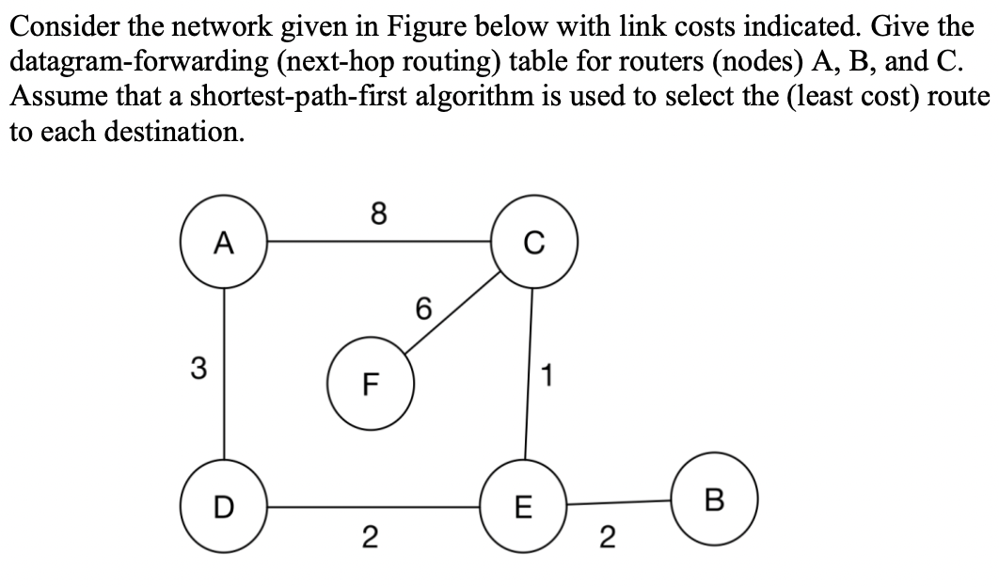

## What is routing in networking? 

Routing is the process of selecting paths in a network along which to send network data. Routers create an overlay network by using the routing information exchanged via routing protocols. This information is used to construct a logical map of the network, which can then be used to determine the best path for data to travel from its source to its destination. There are many routing protocols, we’ll discuss RIP, BGPs.

1. Open Shortest Path First (OSPF)
2. Border Gateway Protocol (BGP)
3. Enhanced Interior Gateway Routing Protocol (EIGRP)
4. Routing Information Protocol (RIP)
5. Intermediate System to Intermediate System (IS-IS)
6. Wireless Routing Protocol (WRP)
7. Multi-Protocol Label Switching (MPLS)
8. Path Vector Routing Protocol (PVRP)
9. Dynamic Source Routing (DSR)
10. Ad Hoc On-Demand Distance Vector (AODV)

### Reviewing old topics

→ Subnetting is the process of dividing a network into smaller subnets. All the subnets are connected and communicate with each other through routers. Each subnet has its own routing table, which is used to route the traffic within the subnet. Routers are used to route the traffic between different subnets. Ref. [subnetting](https://github.com/AbhinavMir/network_grad_notes/blob/main/subnetting.md). 

 ## Distance Vector Routing

Distance-vector routing is a routing protocol that uses a distance vector algorithm to determine the best path for a packet to traverse through a network. A distance vector algorithm calculates the distance (in hops) between the source node and all other nodes in the network. Each node then updates its own routing table to reflect the distances between itself and all other nodes.

**Loops**: Main issue with distance-vector routing is that it can cause routing loops. A routing loop occurs when two or more nodes have incorrect information in their routing tables, causing them to continuously route packets back and forth between each other without ever reaching their intended destination. This results in wasted bandwidth and can lead to network congestion. To prevent routing loops, distance-vector routing protocols use a variety of techniques such as split horizon, route poisoning, and triggered updates.

### Preventing Looping

**Split Horizon**: Split Horizon is a routing algorithm that prevents a router from sending routing information about a route back in the direction from which it came. This prevents a router from creating a loop by re-advertising a route that it has already received.

**Route Poisoning**: Route Poisoning is a technique used in distance-vector routing protocols to indicate that a route is unavailable. When a router detects that a route is down, it advertises an infinite metric (such as 16 or more) for that route to its neighbors. This causes the neighbors to discontinue sending traffic to the route.

**Triggered Updates**: Triggered Updates is a technique used by distance-vector routing protocols to quickly propagate changes in the network topology. When a router detects a change in the network, it sends out an update to all of its neighbors. This update includes the new information as well as the route to the changed network. This allows the routers to adjust their routing tables quickly, avoiding routing loops.

## Routing Information Protocol

Routing Information Protocol (RIP) is a distance-vector routing protocol used to find routing paths in IP networks. It works by broadcasting its routing table to all other connected routers at regular intervals. The routers then use this information to dynamically update their routing tables and build the best path to each destination. RIP is a simple and effective routing protocol, but it has some limitations and can cause slow convergence times in large networks.

## Next Hop Routing

Next hop routing is a routing technique used in computer networks. It is a method of determining the next network node to which a packet should be forwarded on its way to its destination. In next hop routing, each router determines the optimal next stop on the packet's journey to its destination. This is done by examining the routing table and choosing the best route based on criteria such as the shortest path, the least amount of hops, or the lowest cost. The router then forwards the packet to the next hop, which is the next router in the path.

### Sample Question

*Answer*

First, make a routing table for A. Select the lowest cost path from A.

Once selected, in this case D, map the path from node N to D, and add the cost to cost(AD). Thus the routing table looks like this.

**Routing table for Node A**

| Destination | Next-Hop | Cost |
|-------------|----------|------|
| A           | 0        |     |
| B           | D        | 7   |
| C           | D        | 6   |
| D           | D        | 3   |
| E           | D        | 5   |
| F           | D        | 12  |

**Routing table for Node B**

| Destination | Next-Hop | Cost |
| --- | --- | --- |
| A | E | 7 |
| B | - | 0 |
| C | E | 3 |
| D | E | 4 |
| E | E | 2 |
| F | E | 9 |

**Routing table for Node C**

| Destination | Next-Hop | Cost |
| --- | --- | --- |
| A | E | 6 |
| B | E | 3 |
| C | - | 0 |
| D | E | 3 |
| E | E | 1 |
| F | F | 6 |

## D-V routing vs NH Routing

Distance Vector routing and Next hop routing are two different types of routing protocols. Distance Vector routing (also known as Bellman-Ford or RIP) is a routing protocol that uses the distance to a destination to determine the best path to take. It sends information about a network's topology to its neighbors, who then use the information to update their own routing tables. Next hop routing is a more efficient routing protocol that sends packets directly to their destination without waiting for information from its neighbors. It uses the concept of a next hop address to determine the best path to take. It is often used in large networks because of its speed and efficiency.

## Policy Based Routing

Policy based routing (PBR) is a type of routing that enables an administrator to create specific rules to determine which route a packet should take in a network. It is often used to override the default routing table and route packets based on the source address, destination address, protocol type, and other criteria. It is used to provide more control over the network traffic, allowing the administrator to prioritize certain types of traffic, improve network performance and security, and provide a high level of resilience. PBR can be used to route a packet based on the type of service, such as the Voice Over IP (VoIP) or streaming video, or to prioritize certain types of traffic, such as those from a particular source IP address or subnet.

**Re: BGP**: Border Gateway Protocol (BGP) is a routing protocol used to route traffic on the Internet. It is the protocol used by Internet Service Providers (ISPs) to exchange information about how to route traffic between their networks. BGP is used to determine the best path for data to travel from one network to another. It is an exterior gateway protocol (EGP) that is used for exchanging routing information between autonomous systems (ASes) on the Internet. BGP is the only protocol used to exchange routing information between different ASes and is a key component of the Internet’s inter-domain routing system.

