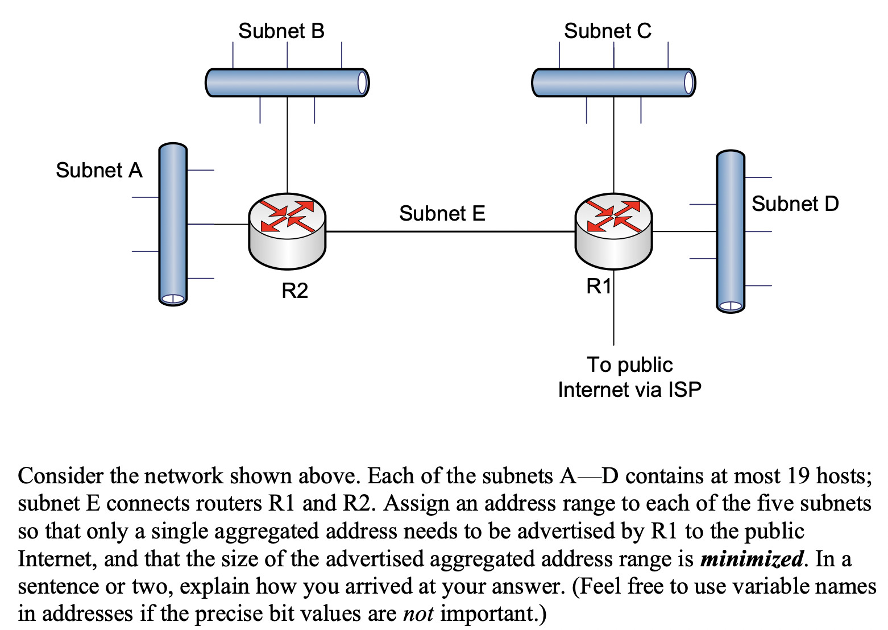

## Subnetting

Good to know: [IP Addressing](https://github.com/AbhinavMir/network_grad_notes/blob/main/ip_addr.md)

Subnetting is the process of dividing a single network into multiple smaller networks, or subnets. It is used to break up large networks into more manageable sizes. Subnetting is done to improve network performance, security, and control. Abstraction is a core principle of computer science, subnetting is the Liskov-equivalent of Object Oriented Programming in Networking.

Subnets are created by applying a subnet mask to the IP address of each device on the network. The subnet mask is a 32-bit number that is used to identify which portion of the IP address is the network identifier and which part is the host identifier. The network identifier is used to identify which network a device is on, and the host identifier is used to identify which device on the network it is.

Subnets are usually divided up into “classes”, with each class having a different subnet mask. 

Subnets can also be divided up into “sub-subnets”, which are further divisions of the original subnet. Sub-subnetting allows for even finer control over the network. It’s not in the scope of discussion for this repository.

Conclusion: **Converting Host bits to Network bits**

**Supernetting** is not a topic we will go in details of, but supernetting is a method of aggregating multiple network address prefixes into a single, larger prefix. It is used to simplify the routing and management of large networks by providing a single route advertisement to a provider's network. Supernetting is also known as Classless Inter-Domain Routing (CIDR). This is because it eliminates the use of the traditional IP class system for routing. Supernetting allows for more efficient use of IP address space, as it allows for multiple networks to be grouped together under one larger address.

Conclusion: **Converting Network bits to Host bits**

## Example of Subnetting: In an office

1. An office network with the IP address range of `192.168.1.1`-`192.168.1.255` could be subnetted into four smaller networks, each with a range of `192.168.1.1`-`192.168.1.63`, `192.168.1.64`-`192.168.1.127`, `192.168.1.128`-`192.168.1.191`, and `192.168.1.192`-`192.168.1.255`.

2. A network with the IP address range of `10.10.1.1`-`10.10.255.255` could be subnetted into four subnets, each with a range of `10.10.1.1`-`10.10.31.255`, `10.10.32.1`-`10.10.63.255`, `10.10.64.1`-`10.10.95.255` and `10.10.96.1`-`10.10.127.255`.

## Sample Question

(a) What is the aggregated CIDR address?

*Answer*: Since there are 4 subnets between A to D, each having 19 hosts, we have 4*19 = 76 addresses, but R2 and R1 also reserve addresses, so 78. $2^6 = 64$ and $2^7 = 128$, so we take max(2^n) > number of addresses. $log_2128$ = 7 bits. This gives you the number of bits required to represent the number of addresses. For example, if the number of addresses is 256, the answer would be 8, since $2^8 = 256$. Once we have number of bits, we know we now need to reserve, which is (32-7) = 25 bits CIDR. So `x.y.z.0/25`

(b) Subnet “A” CIDR address range

*Answer*: 19 addresses is >2^4, but less than 2^5, so we reserve 2^5. If you $32-log_2{2^5}=27$, you get the CIDR, because now you subnet mask over first 27 bits, and you have (reasonable) free reign over the last 5 addresses. So the answer is `x.y.z.0/27` 

(c) Subnet “B” CIDR address range

*Answer*: Since A CIDR has taken over `x.y.z.0/27` , we can allocate `x.y.z.32/27` 

(d) Subnet “C” CIDR address range: `x.y.z.64/27` ~ subnet “D” will be `x.y.z.96/27`

(e) Subnet “E” CIDR address range: Since subnet E connects only R1 and R2, we need only two useable IPs here so we can just allocate from A’s address space. `x.y.z.0/31`.

## Further Reading

1. [Introduction to supernetting](https://www.youtube.com/watch?v=m7TwQ24lF74)
2. 