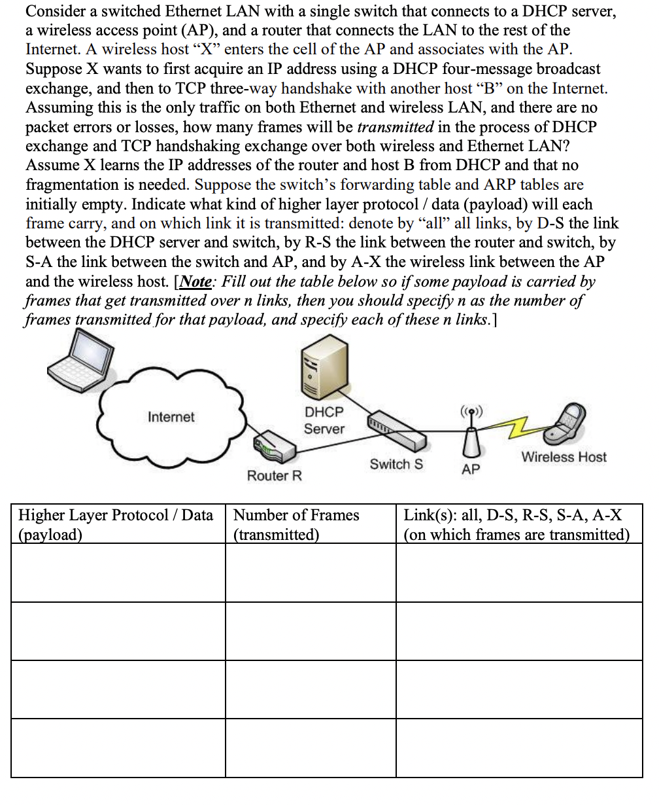
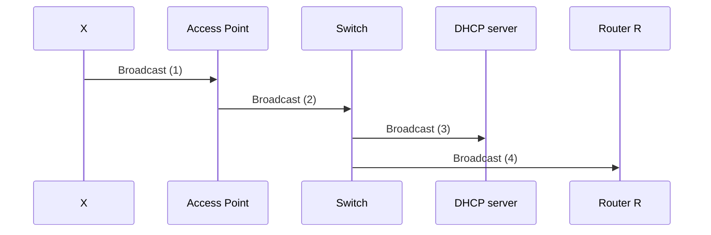

## Sample questions

*Answer*: For this problem, you can refer to [FAQ](dumb_questions.md) for clarification on what is a *frame*. Every point of communication here will emit a frame. 4 types of messages in DHCP: Discover, Offer, Request, Ack - all are broadcasts.

Assuming this is the only traffic on both Ethernet and wireless LAN, and there are no packet errors or losses, how many frames will be transmitted in the process of DHCP exchange and TCP handshaking exchange over both wireless and Ethernet LAN?

For DHCP exchange, the router will hit the Access Point (AP) first with DHCP broadcast, then it’ll hit the Switch S, then it’ll hit both DHCP server and Router R (since it has no clue where the DHCP server is). The 4 message type request will ask for 4 frames. Since we traversed 4 links, the emitted frames will be 4*4 = 16 frames.

When DHCP replies and allocates you IP, it also gives you IP of the router. This device has router’s IP address, but not MAC address, so for that we need to use ARP.

| higher layer protocol/data | number of frames transmitted | Links                   |
| -------------------------- | ---------------------------- | ----------------------- |
| DHCP 4 message broadcast   | 4*4 = 16 frames              | X-AP, AP-S, S-DHCP, S-R |
| ARP (Address resolution)   | 4 frames                     | ----------------------- |
| DHCP 4 message broadcast   | 4*4 = 16 frames              | X-AP, AP-S, S-DHCP, S-R |

